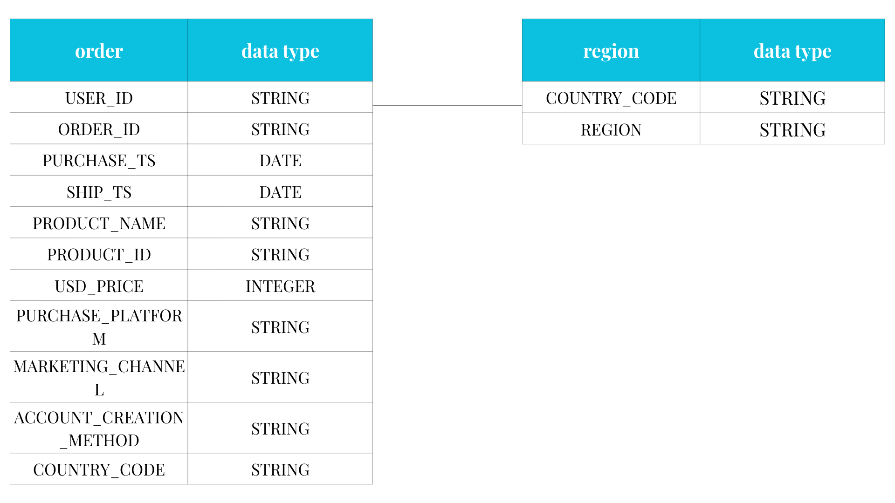

# Gamezone Retail Project
## Project Background
GameZone is a global gaming retailer founded in 2018, specializing in selling both new and refurbished gaming products. The company operates through multiple digital touchpoints, including an online website and a mobile application, and leverages a variety of marketing channels to reach customers worldwide.

This project analyzes GameZone’s transactional and marketing data from a stakeholder’s point of view, with the goal of understanding overall business performance. The analysis focuses on identifying key sales trends across different products, marketing channels, and geographic regions. By grounding the analysis in clear business goals, this project aims to generate insights that are relevant, actionable, and aligned with real-world decision-making within the organization.

The findings from this analysis are intended to support stakeholders in evaluating performance, understanding drivers of growth and decline, and identifying opportunities to optimize product strategy, marketing effectiveness, and regional expansion.

Insights and recommendations are provided on the following key areas:

- **Overall Sales Trends:** Analysis of total sales, identifying revenue growth trends and monthly fluctuations.
- **Seasonal Demand Patterns:** Assessment of monthly sales trends, highlighting strong performance with specific seasons.
- **Product Performance:** Evaluation of top and low performers with leading and underperforming sales.
- **Channel Performance & Marketing Effectiveness:** Analyzes sales contribution by marketing channels.
- **Regional Performance & Market Shifts:** Evaluates sales behavior across geographic regions.

The Excel File of raw dataset for this analysis can be found [here](raw_data_gamezone_orders.xlsx).

The Excel File utilized to clean, organize and prepare data for the dashboard can be found [here](gamezone_cleaned.xlsx).

The Excel File utilized to inspect and perform quality checks can be found [here](gamezone_quality_checks.xlsx).

The Excel File regarding various business questions can be found [here](gamezone-orders-data.xlsx).

## Data Structure & Initial Checks

The GameZone database structure as below consist of two tables: order and region with a total row of 21,865 records. A description of each table is as follows:

- **order:** Stores individual customer orders, including who made the purchase, what was bought, when it was purchased and shipped, how and where the order was made.

- **region:** Stores a mapping between each country code and its assigned geographic region.
## Executive Summary 
## Overview Of Findings
Overall performance from 2019 to 2021 shows strong revenue growth driven by a surge in demand starting in early 2020, with clear signs of seasonality and concentration across products, channels, and regions.

Total revenue reached $6.2M, supported by an order volume of 21.7K and an Average Order Value (AOV) of $283.8, indicating that revenue growth was driven by both order activity and relatively high-value purchases.

Sales trends reveal a steady increase through 2019, followed by a significant acceleration in 2020, culminating in a peak during December 2020, which recorded the highest monthly sales at approximately $549K. This spike, along with stronger performance in fall and winter months, suggests a combination of seasonality, holiday demand, and potential promotional activity, amplified by broader market conditions during the COVID period. In contrast, February 2019 marked the lowest sales month, highlighting how much demand shifted over time.

Product Performance is highly concentrated among top products, suggesting a reliance on a few key revenue drivers. The 24in 4K Gaming Monitor leads with 32% of total sales, making it the top-performing product followed by Nintendo Switch (27%) and Sony PlayStation 5 Bundle (26%). Together, the top three products account for over 80% of total product sales, indicating heavy reliance on a small number of best-sellers. Several accessories (gaming mouse, headset contribute minimally, highlighting potential opportunities for bundling, upselling or reconsidering inventory strategy.

Channel analysis shows that Direct traffic overwhelmingly dominates revenue, contributing 84.7% of total sales, while other channels such as email, affiliate, and social media play a much smaller role. This suggests strong brand-driven or repeat purchasing behavior but also highlights an opportunity to diversify and strengthen secondary marketing channels.

From a geographic perspective, North America (NA) is the primary revenue contributor at 52.1%, followed by EMEA (30.3%), with APAC (12.1%) and LATAM (5.5%) contributing smaller shares. This indicates a strong regional concentration in NA, with growth potential in underpenetrated regions.

Below is the overview page from the Tableau dashboard. The entire interactive dashboard can be downloaded [here](https://public.tableau.com/views/GameZoneRetailProject/Overview?:language=en-US&publish=yes&:sid=&:redirect=auth&:display_count=n&:origin=viz_share_link).

## Insights Deep Dive
**Sales Trends of Product Performance:**
- Over the 2019-2021 period, the Top 3 products (27in 4K Gaming Monitor, Nintendo Switch, Sony PlayStation 5 Bundle) are clearly driving overall revenue and orders. The 27in 4k Gaming Monitor emerged as the top revenue driver with steadily rising sales and strong order counts, reflecting consistent demand and broad market appeal. The Sony PS5 Bundle maintained the highest AOV (Average Order Value) especially in December 2020, showing its premium positioning, but its order count was more constrained, likely due to availability. The Nintendo Switch exhibited variable sales and order spikes, driven by stock availability and seasonal demand, while its AOV showed moderate growth.
- High-value products like Sony PS5 drive revenue strength, while stable mid-tier offerings like the gaming monitor capture consistent demand. Console sales were more volatile, emphasizing the impact of supply cycles and promotional timing on performance.   
- Order counts show that spikes in December 2020 across all top products drove the overall revenue peak.
- Overall, product-level performance explains why December 2020 was a peak: strong sales from high-value and popular products.

**Channel Performance & Marketing Effectiveness:**
- Direct channel dominates sales across all top products, especially during December 2020, making it the main driver of sales spikes.
Other channels (email, affiliate, social media) contribute minimally in comparison.
- Breakdown by product shows that Sony PlayStation 5 Bundle sales drop in early 2021 was mostly from a decline in direct channel, explaining part of the post-peak revenue decrease.
- Marketing effectiveness is heavily tied to direct channel campaigns, signaling a potential area to optimize or diversify.

**Regional Performance & Market Shifts:**
- All regions show similar seasonal trends, confirming a macro/global impact, likely related to COVID-19 demand changes.
NA region leads in revenue, particularly for high-value products, but also shows a sharp dip in early 2021, mostly driven by direct channel sales.
- Other regions (EMEA, APAC, LATAM) follow the same pattern, indicating the revenue spike and dip was not localized, but a global trend.
Regional insights highlight market shifts and can guide decisions for regional promotions, inventory planning, and marketing focus.

Below is the product insights page from the Tableau dashboard. The entire interactive dashboard can be downloaded [here](https://public.tableau.com/views/GameZoneRetailProject/ProductInsights?:language=en-US&publish=yes&:sid=&:redirect=auth&:display_count=n&:origin=viz_share_link).

## Recommendations:
Based on the uncovered insights, the following recommendations have been provided.
- **Double down on top-performing products while managing post-peak demand.**
Prioritize inventory planning, pricing strategy, and promotional support for the top three revenue drivers (27in 4K Gaming Monitor, Nintendo Switch, and Sony PlayStation 5 Bundle). Since these products largely explain both the December 2020 peak and the early 2021 decline, improve demand forecasting and launch staggered promotions to avoid sharp post-holiday drops.
- **Strengthen and diversify channel strategy beyond direct traffic.**
Direct traffic is the primary driver of revenue but also the main source of volatility. Invest in scaling email, affiliate, and paid social channels to reduce reliance on direct traffic and create a more stable, diversified acquisition mix—especially during non-peak periods.
- **Investigate and replicate December 2020 drivers.**
Conduct a deeper analysis of promotions, pricing changes, product availability, and marketing campaigns during December 2020. Successful tactics should be replicated or adapted for future peak periods (e.g., holiday campaigns, limited bundles, or urgency-based offers).
- **Address regional-specific declines with targeted strategies.**
While sales trends are global, the sharper decline in NA—especially for the Sony PlayStation 5 Bundle via direct channel—suggests regional demand shifts or competitive pressure. Introduce region-specific campaigns, pricing tests, or alternative bundles to stabilize performance in key markets.
- **Re-evaluate underperforming categories and products.**
Headsets contribute less than 2% of total sales and show weak performance. Validate data completeness, then consider product repositioning, bundling with high-performing items, or deprioritizing inventory to reallocate resources toward higher-impact products.
- **Plan for seasonality with proactive inventory and marketing alignment.**
Consistent fall and winter sales spikes indicate strong seasonality. Align inventory procurement, marketing spend, and staffing ahead of these periods to maximize revenue while minimizing stockouts and post-peak slowdowns.

## Assumptions & Caveats:
Throughout the analysis, multiple assumptions were made to manage challenges with the data. These assumptions and caveats are noted below:
- **Inconsistent date formats** were standardized using date functions to ensure all timestamps were properly formatted and comparable across the dataset.
- **Missing purchase or ship dates** were left unchanged due to their low frequency and the absence of reliable information to accurately infer missing values.
- **Inconsistent product naming** (e.g., variations of “27in 4K gaming monitor”) was resolved by recategorizing entries under a single, standardized product name to ensure accurate aggregation and analysis.
- **Transactions with missing or $0 USD prices** were retained in the dataset, as there was no reliable way to infer correct values. These cases would require validation with stakeholders before exclusion or correction.
- **Missing marketing channel values** were recategorized as “Unknown” to preserve record completeness while maintaining transparency around data gaps.
- **Missing account creation method values** were also recategorized as “Unknown”, following the same approach used for marketing channels.
- **Missing country codes** were left as-is, as inferring geographic information without supporting data could introduce inaccuracies. Further clarification from stakeholders would be required.
- **Inconsistent or nonsensical region values** were corrected by mapping valid country codes to their appropriate regions using a trusted lookup reference.
- **Duplicate order IDs** were retained, as they represented a low volume of records. These could be removed if required for future order-level analyses.
- **Shipping timestamps** occurring before purchase timestamps were left unchanged. While not addressed in this analysis, these records should be flagged in future analyses that focus on fulfillment or logistics performance.

